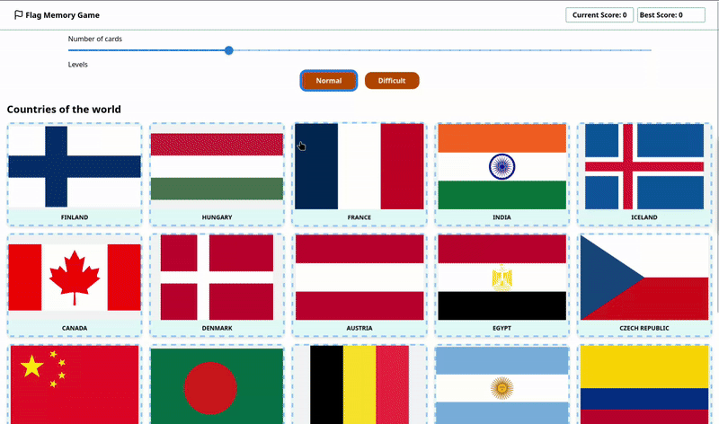
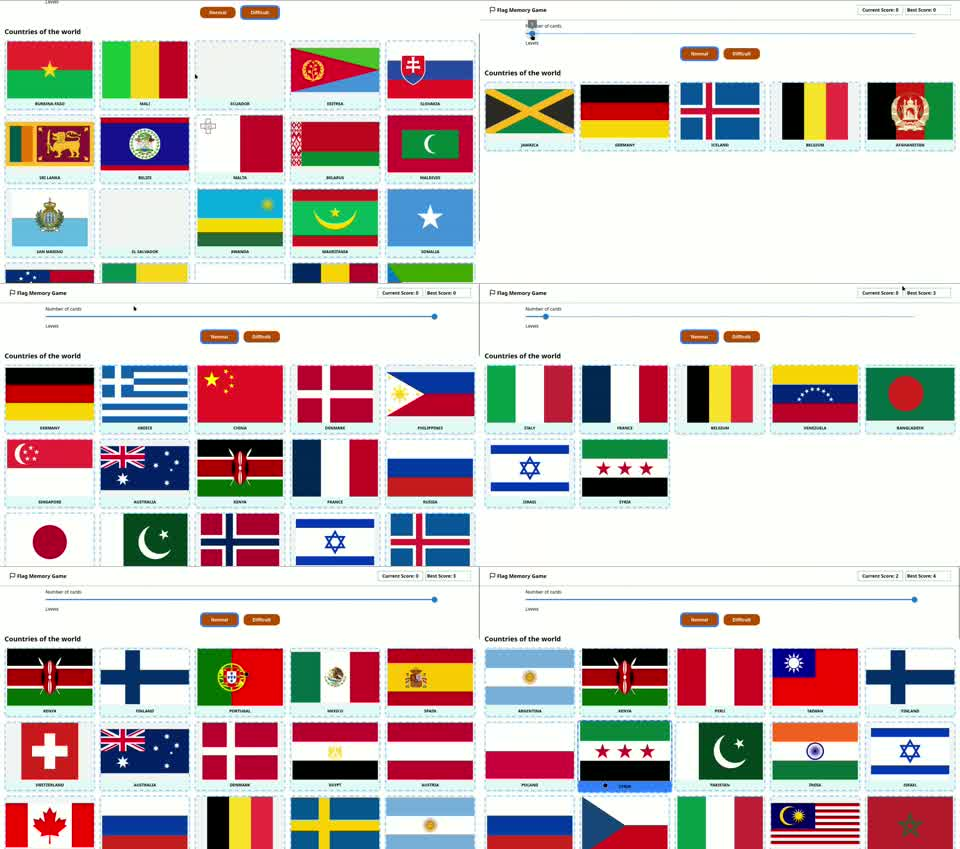
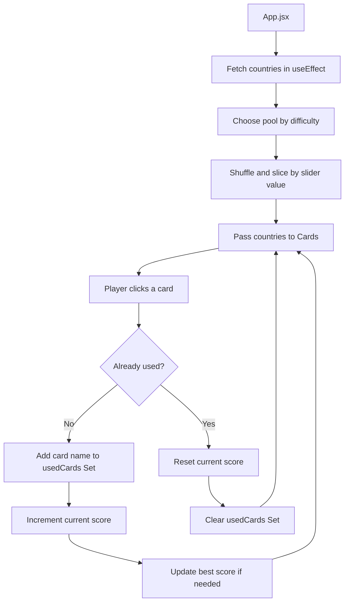
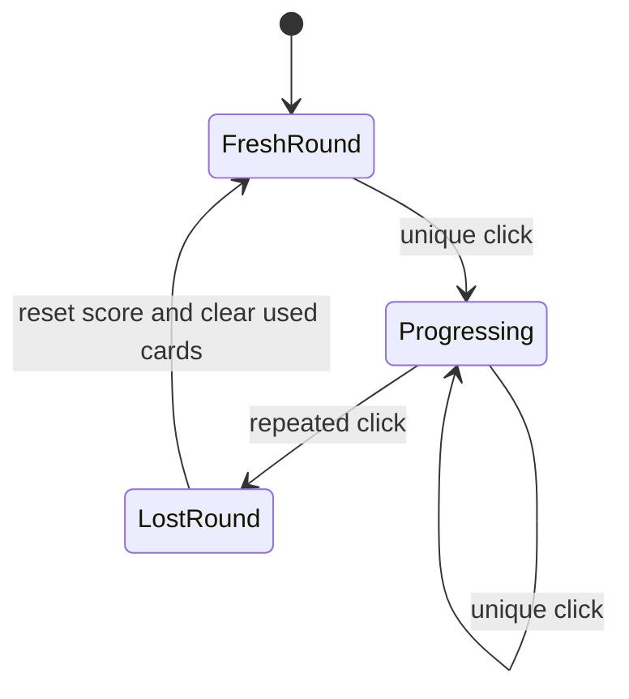
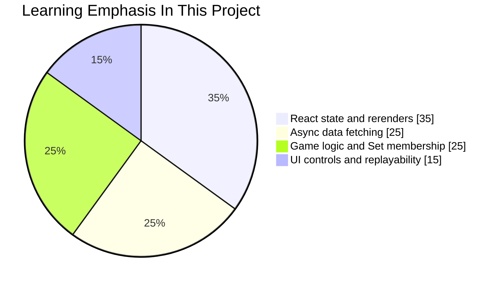

# Odin Memory Card

A React memory game built around country flags. The goal is simple: click each card only once. Every unique click increases your score, and one repeated click resets the round.

Live demo: [odinmemory-card-souj.vercel.app](https://odinmemory-card-souj.vercel.app/)

<p align="center">
  
</p>

<p align="center">
  Raw walkthrough video: <a href="./docs/preview.webm">preview.webm</a>
</p>

## Overview

This project focuses on a small but surprisingly rich game loop:

- fetch a dataset of countries and flags
- build a randomized deck from that dataset
- track which cards have already been clicked
- update current and best scores
- reset the round instantly when the player repeats a card

It also adds two replayability controls:

- a slider that changes the number of visible cards
- a difficulty toggle that switches between more familiar and less familiar country pools

## Project Snapshot

| Area | Notes |
| --- | --- |
| Core idea | Memory game based on country flags |
| Built with | React 19, Vite, Tailwind CSS, Material UI, Lucide |
| Main React concepts | `useState`, `useEffect`, lifted state, prop-driven rendering |
| Data source | `https://countriesnow.space/api/v0.1/countries/flag/images` |
| Deployment | Vercel |
| Main challenge | Keeping the game state simple while handling asynchronous data and shuffled cards |

## Screens At A Glance



## Feature Set

- Randomized card layout on every render cycle
- Current score and best score tracking
- Duplicate-click detection using a `Set`
- Adjustable deck size with a slider
- Two difficulty pools: familiar countries and less familiar countries
- Responsive grid layout for the cards
- Lightweight top navigation with score display

## How It Works







## Academic Value

This is a good academic project because it sits at the intersection of several important frontend ideas:

- **State modeling:** the app turns a simple game into a clear state machine with scores, used cards, difficulty, and deck size.
- **Algorithmic thinking:** a `Set` is used for fast membership checks, which is a more appropriate data structure than repeatedly scanning an array.
- **Asynchronous programming:** the game fetches its dataset through `useEffect`, so it exercises loading-time logic rather than relying on hardcoded local data.
- **Component architecture:** score display, card rendering, and top-level state responsibilities are separated into small React components.
- **Data quality awareness:** real APIs are messy, and this project exposes that reality quickly.

For students, it is a nice example of how a "small game" can teach event handling, state lifting, side effects, UI composition, and data hygiene all at once.

## What Was Learned

- How to fetch remote data inside `useEffect` and re-run that logic when dependencies change.
- Why lifted state in `App.jsx` is a clean way to keep scores and gameplay in sync across components.
- Why a `Set` is a strong fit for uniqueness checks in interactive apps.
- How small UI controls like a slider and a difficulty toggle can make a simple project feel much more replayable.
- Why initial plans often change once implementation starts.
- Why `useRef` is not always the right answer; in this case, regular React state and props were the better fit for score display.

> "No plan ever comes to existence as pictured."
>
> That note from the project captures the real development process well. The first design idea changed, but the final result became more grounded in actual gameplay and state flow.

## Difficulties And Tradeoffs

### 1. External API quality

The project comments already call out a real issue: the chosen flags API is imperfect and misses some expected countries. That turns the app into a stronger learning exercise, because the code has to work around incomplete data rather than assuming a perfect backend.

### 2. Balancing simplicity with replayability

Adding card count controls and difficulty selection improves the experience, but also introduces more state transitions to manage. A tiny app stops feeling tiny once the game rules and UI settings begin interacting.

### 3. Randomization is easy to start, harder to perfect

Using `sort(() => Math.random() - 0.5)` is a common beginner-friendly shortcut, but it is not the most rigorous shuffle approach. It works well enough for a learning project, while also leaving room for a future Fisher-Yates upgrade.

### 4. Naming and scalability

The current `level` boolean works, but the project notes are right: more descriptive naming would make future scaling easier if more difficulty modes are added.

## Existing Optimizations And Good Engineering Choices

- `usedCards` is stored as a `Set`, which gives near-constant-time duplicate checks.
- The fetch effect only reruns when `number` or `level` changes, which keeps the side effect tied to meaningful gameplay settings.
- The app narrows the dataset to curated country pools before building the playable deck.
- The `ignore` guard in the effect cleanup helps avoid stale state updates after unmount or dependency changes.
- Scores are centralized in `App.jsx`, which avoids scattered score logic across child components.

## Next Optimizations Worth Exploring

- Replace the shuffle shortcut with Fisher-Yates for cleaner randomness.
- Avoid mutating the `countries` prop during render by shuffling a copied array first.
- Cache fetched country data locally so difficulty changes do not require recomputing from scratch every time.
- Persist the best score in `localStorage`.
- Add explicit loading and error UI states instead of logging errors silently.
- Improve accessibility with `alt` text, keyboard support, and live score announcements.
- Add a third "obscure countries" mode, since the codebase already hints at that direction.

## Representative Code Snippets

The heart of the game is the repeated-click check:

```jsx
function onCardClick(name) {
  if (usedCards.has(name)) {
    onScore(false);
  } else {
    const updatedUsedCards = new Set([...usedCards, name]);
    setUsedCards(updatedUsedCards);
    onScore(true);
  }
}
```

And a condensed version of the main async learning point is the effect that fetches, filters, and refreshes the deck:

```jsx
useEffect(() => {
  let ignore = false;

  async function getCountries() {
    const resu = await fetch(COUNTRIES_NAMES_FLAGS_API);
    const data = await resu.json();

    if (!ignore) {
      const countriesPool = level ? wellKnownCountries : lessKnownCountries;
      const polishedCountries = data.data
        .filter((item) => countriesPool.includes(item.name))
        .sort(() => Math.random() - 0.5)
        .slice(0, number);

      setCountries([...polishedCountries]);
    }
  }

  getCountries();
  return () => {
    ignore = true;
  };
}, [number, level]);
```

## Tech Stack

- React
- Vite
- Tailwind CSS
- Material UI Slider
- Lucide React
- Fetch API

## Project Structure

```text
.
├── docs
│   ├── preview-contact.jpg
│   ├── preview.gif
│   └── preview.webm
├── public
├── src
│   ├── App.jsx
│   ├── main.jsx
│   ├── components
│   │   ├── Cards.jsx
│   │   └── Nav.jsx
│   └── css
│       └── index.css
├── index.html
└── package.json
```

## Local Setup

```bash
npm install
npm run dev
```

Build for production:

```bash
npm run build
```

## Future Work

- Add a loading skeleton before the countries arrive
- Add win conditions for clearing the whole deck
- Add more polished feedback for losing a round
- Add difficulty labels that scale beyond a boolean
- Improve mobile spacing for very large card counts
- Add scroll affordances for dense layouts

## Final Reflection

This project is small in surface area but rich in lessons. It demonstrates that even a memory game can become a serious React exercise once asynchronous data, randomized rendering, score tracking, UI controls, and replay loops are involved. That makes it a strong portfolio piece for showing not just that a UI works, but that the developer can reason about state, data, and tradeoffs.
